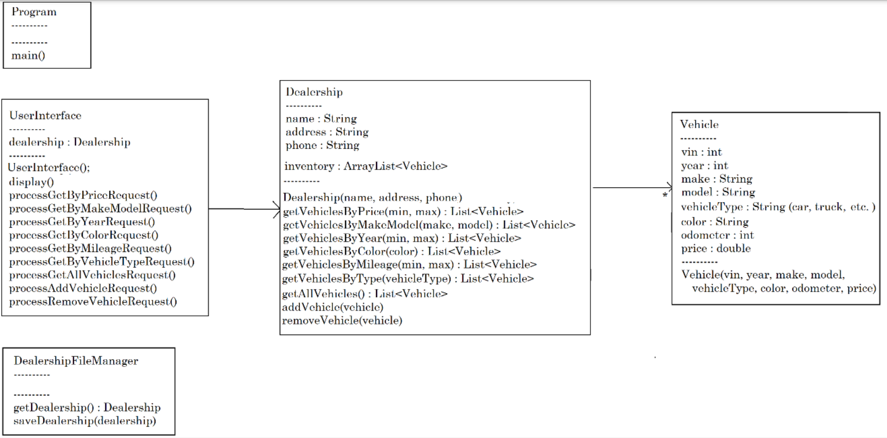
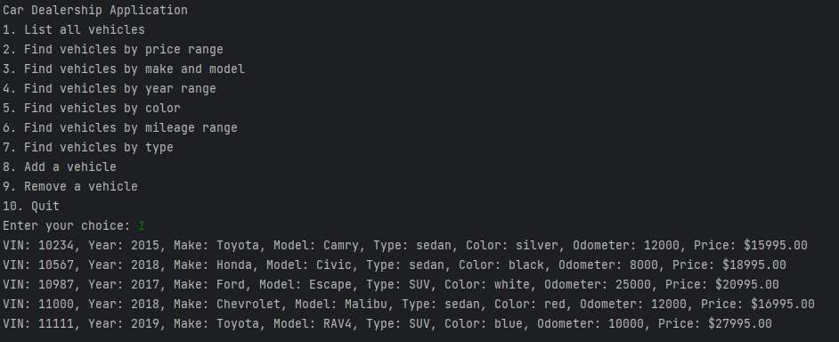
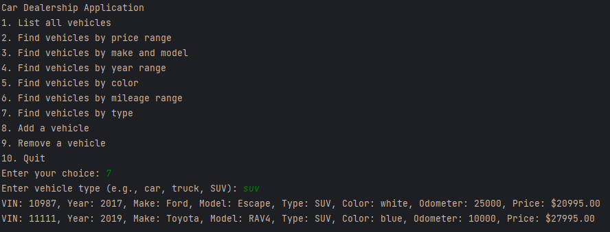
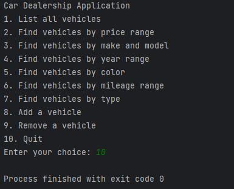

# Car Dealership Console Application

## Description of the Project

This Java console application is designed for use by a dealership salesperson or manager to manage the dealership’s inventory. The application allows users to list, search, add, and remove vehicles, with changes automatically saved to a file. The app provides a streamlined, text-based interface for quick inventory management and is built with Object-Oriented principles to allow for potential expansion.

[Class Diagram]  <!-- Replace with actual image path -->

## User Stories

- As a salesperson, I want to find vehicles by specific criteria (price, make, model, year, etc.) so that I can quickly meet customer needs.

- As a manager, I want to add or remove vehicles from inventory so that my records are always up to date.

- As a user, I want a simple and clear menu interface so I can easily navigate the application’s features.

- As a salesperson, I want to view all available vehicles in the inventory at once so I can provide quick overviews to customers.

- As a user, I want to be able to search for vehicles by mileage range, so I can find options with lower mileage.

- As a manager, I want all changes to the inventory (adding or removing vehicles) to be automatically saved, so data integrity is maintained without additional steps.

- As a user, I want to be able to find vehicles by color so I can meet customer preferences more accurately.

- As a manager, I want the inventory data saved in a consistent format so it’s easy to load and manage.

- As a user, I want to see detailed information about each vehicle, including VIN, make, model, year, color, mileage, and price, so I have all necessary details to make informed choices.

- As a salesperson, I want to quickly search by vehicle type (e.g., car, truck, SUV) to match customer needs based on type preferences.

- As a manager, I want the application to be responsive to any erroneous inputs (like letters in numeric fields), so data integrity and usability are preserved.

- As a user, I want an option to exit the application safely, ensuring that my current session is saved and closed properly.


## Setup

### Prerequisites

- **IntelliJ IDEA**: Ensure you have IntelliJ IDEA installed, which you can download from [here](https://www.jetbrains.com/idea/download/).
- **Java SDK**: Make sure Java SDK (version 8 or later) is installed and configured in IntelliJ.

### Running the Application in IntelliJ

1. Open IntelliJ IDEA.
2. Select "Open" and navigate to the directory where you cloned or downloaded the project.
3. Wait for IntelliJ to index the files and set up the project.
4. Find the `Program` class containing the `public static void main(String[] args)` method.
5. Right-click on `Program.java` and select 'Run 'Program.main()' to start the application.

## Features

The application offers the following functionalities:

1. **List All Vehicles**: Displays all vehicles in the dealership inventory.
2. **Search by Price Range**: Find vehicles within a specified price range.
3. **Search by Make and Model**: Locate vehicles by specific make and model.
4. **Search by Year Range**: Filter vehicles by year range.
5. **Search by Color**: Find vehicles based on color.
6. **Search by Mileage Range**: Filter vehicles by mileage range.
7. **Search by Vehicle Type**: Locate vehicles by type (sedan, truck, SUV, etc.).
8. **Add a Vehicle**: Add a new vehicle to the inventory.
9. **Remove a Vehicle**: Remove an existing vehicle from the inventory.
10. **Quit**: Exit the application.

## Technologies Used

- **Java**: Object-Oriented Programming Language (Java SDK 8+)
- **IntelliJ IDEA**: Integrated Development Environment for Java, corretto-17

## Demo

Include screenshots or GIFs demonstrating the application in action (e.g., listing all vehicles, searching by criteria, adding/removing vehicles).

Application Screenshot  <!-- Replace with actual image path -->



## Future Work

Potential enhancements:

- **Multiple Dealership Management**: Allow switching between multiple dealership inventories.
- **Database Integration**: Transition from file-based persistence to a database for scalability.
- **Enhanced Search**: Add advanced filtering options such as search by multiple criteria at once.

## Interesting Code Example

One interesting piece of code in this project is the `saveDealership()` method in `DealershipFileManager`, responsible for saving changes to the inventory file whenever a vehicle is added or removed. This method demonstrates file handling in Java and the importance of persistence in managing inventory.

```java
public void saveDealership(Dealership dealership) {
    try (PrintWriter writer = new PrintWriter(new FileWriter("inventory.csv"))) {
        writer.printf("%s|%s|%s%n", dealership.getName(), dealership.getAddress(), dealership.getPhone());
        for (Vehicle vehicle : dealership.getAllVehicles()) {
            writer.printf("%d|%d|%s|%s|%s|%s|%d|%.2f%n",
                    vehicle.getVin(), vehicle.getYear(), vehicle.getMake(), vehicle.getModel(),
                    vehicle.getVehicleType(), vehicle.getColor(), vehicle.getOdometer(), vehicle.getPrice());
        }
    } catch (IOException e) {
        System.out.println("Error saving file: " + e.getMessage());
    }
} 
```
This code is interesting because it ensures that each change in the application’s state is persistently saved, which is essential for data integrity.

## Resources

- [Java Programming Basics](https://www.java.com/en/)
- [Effective Java by Joshua Bloch](https://www.oreilly.com/library/view/effective-java/9780134686097/)
- [Maven: The Complete Reference](https://maven.apache.org/guides/index.html)

## Team Members

- **Mehmet Uzun** - Developer

## Thanks

- Thank you to **Raymond Maroun** for continuous support and guidance.
- A special thanks to all teammates for their dedication and teamwork throughout the project.
